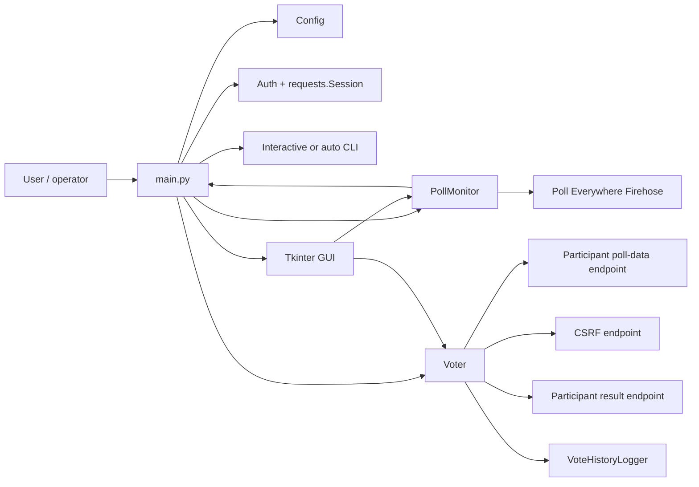
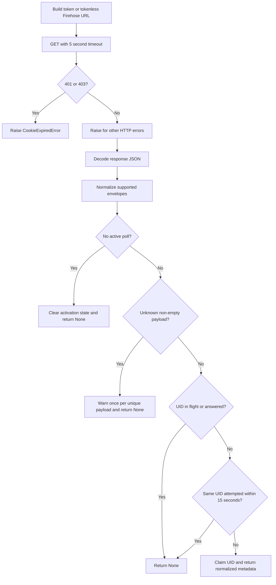

# AutoPollEv Detection Failure: Technical Report and Remediation Guide

**Document status:** Implemented and locally verified  
**Repository:** `SamoyedCodes/autopollev`  
**Report date:** 2026-09-01  
**Affected component:** `autopollev.monitor.PollMonitor`

## 1. Executive summary

AutoPollEv could fail to detect an active Poll Everywhere activity because its
Firehose parser accepted only one response shape:

```json
{
  "message": "{\"uid\": \"poll-id\", \"type\": \"multiple_choice_poll\"}"
}
```

The implementation assumed that:

1. the HTTP response body was a JSON object;
2. that object contained a `message` property;
3. `message` was a JSON-encoded string; and
4. the decoded object contained a top-level `uid`.

If `message` was already a JSON object, was double encoded, was nested under an
event wrapper, or was part of a message list, the activity was rejected or an
exception escaped. Some response and parsing errors were also converted into a
plain `None`, making a protocol change indistinguishable from “no active poll.”

The remediation adds a bounded, backward-compatible response normalizer,
proper HTTP status validation, one-time diagnostics for unknown payloads, and
thread-safe, activation-scoped duplicate suppression. The mocked regression
suite now covers both detection and claim resolution. The repository also
installs correctly on non-Windows systems after restricting `win11toast` to
Windows.

## 2. Scope and evidence

### 2.1 In scope

- Firehose response acquisition and poll metadata extraction.
- Duplicate suppression and same-poll reactivation.
- HTTP, authentication, timeout, and malformed-payload behavior.
- Unit-level regression coverage without sending a real vote.
- Cross-platform dependency installation required to run the tests.

### 2.2 Out of scope

- Changes to Poll Everywhere itself.
- Automated end-to-end voting against a live poll.
- Support for activity types other than the repository’s existing
  multiple-choice voting endpoint.
- Recovery of expired or missing user credentials.
- Verification that use of the application complies with an organization’s or
  Poll Everywhere’s terms and policies.

### 2.3 Evidence and verification boundary

The root cause is reproducible directly from the previous parser: passing an
object-valued `message` to `json.loads()` raises `TypeError`, while nested/list
payloads never expose the expected top-level `message` and `uid` combination.
The regression suite exercises these cases with deterministic response
fixtures.

A read-only request to the public Firehose host was attempted during diagnosis,
but the endpoint timed out without returning bytes. Therefore, this report does
not claim that a particular undocumented live payload shape was observed. The
fix instead preserves the legacy format and safely accepts a bounded set of
common envelope variations. Unknown formats now produce an actionable warning
rather than failing silently.

## 3. System architecture



### 3.1 Component responsibilities

| Component | Responsibility |
|---|---|
| `main.py` | Parses arguments, initializes services, runs the CLI loop, and handles shutdown. |
| `autopollev/config.py` | Loads and validates `config.json`; exposes typed configuration properties. |
| `autopollev/auth.py` | Creates the HTTP session, applies cookies, gets CSRF/Firehose tokens, and detects 401/403 responses. |
| `autopollev/endpoints.py` | Centralizes remote endpoint templates. |
| `autopollev/monitor.py` | Polls Firehose, normalizes response envelopes, suppresses duplicates, and returns poll metadata. |
| `autopollev/voter.py` | Fetches multiple-choice options and submits a selected response. |
| `autopollev/gui.py` | Runs monitoring in a background thread and handles dialogs/events on the Tkinter thread. |
| `autopollev/logger.py` | Provides console logging and JSONL vote history. |
| `autopollev/notifier.py` | Sends optional Windows notifications. |
| `autopollev/i18n.py` | Supplies English and Chinese UI strings. |

## 4. Detection lifecycle

After `PollMonitor.start()` obtains the optional Firehose token, both the CLI
and GUI call `check_new_poll()` once per configured polling interval.



The caller retrieves poll details, verifies that the state is `opened`, and
then submits or requests a choice. `check_new_poll()` claims the UID before it
returns, so a slow GUI dialog cannot enqueue the same question again. A
successful vote calls `mark_answered(uid)`; locked or temporary failures call
`mark_retryable(uid)` so they can be tried again after the cooldown.

## 5. Root-cause analysis

### 5.1 Primary fault: rigid envelope parsing

The previous algorithm performed the equivalent of:

```python
data = response.json()
message = data.get("message")
poll_info = json.loads(message)
poll_uid = poll_info.get("uid")
```

This is valid only for a JSON-string `message` with a direct `uid`. The
following semantically equivalent response failed:

```json
{
  "message": {
    "uid": "poll-object",
    "type": "multiple_choice_poll"
  }
}
```

`json.loads()` expects a string, bytes, or byte array, so an object-valued
message raises `TypeError`. The monitor did not catch this type at its protocol
boundary.

### 5.2 Nested and batched payloads were invisible

An event envelope such as the following contains a usable permalink, but the
previous parser never searched it:

```json
{
  "data": {
    "messages": [
      {"event": "heartbeat"},
      {
        "activity_type": "multiple_choice_poll",
        "activity": {
          "poll": {"permalink": "poll-nested"}
        }
      }
    ]
  }
}
```

The new normalizer searches only approved wrapper and identifier keys. It does
not perform an unrestricted recursive search, which could incorrectly select
an option ID or unrelated user ID.

### 5.3 HTTP failures were not validated at the monitor boundary

The monitor checked only whether a response indicated expired authentication.
It did not call `raise_for_status()` before parsing. A 404, 429, or 5xx response
could therefore enter the JSON parser and appear to be an unsupported Firehose
format.

The fixed implementation handles these responses as request failures and feeds
them into the existing retry/token-refresh behavior.

### 5.4 Unknown payloads were operationally silent

Malformed or changed data generally returned `None`, the same value used for a
normal idle presenter. Operators had no clear signal that the protocol was no
longer understood.

The monitor now logs one warning for each unique unrecognized non-empty
payload. Repeated identical values do not flood the log. A normal empty
response, such as `{"message": null}`, remains silent.

### 5.5 Answered IDs were suppressed for the process lifetime

The previous `_answered_polls` set never removed a UID. If a presenter closed a
poll and later activated the same poll again, AutoPollEv continued treating that
UID as already handled.

Suppression is now scoped to the current activation:

- a successful response suppresses repeats while that poll remains active;
- an empty Firehose response clears active-poll state;
- switching to a different UID clears the per-activation answered set; and
- reactivating an earlier UID makes it eligible again.

A separate integer tracks the cumulative number of successful handled
activations, so the GUI/CLI count does not reset when activation state changes.
In-flight claims are kept separately from answered state and are not cleared by
a Firehose read timeout or an explicit inactive response. This prevents a slow
or queued handler from processing the same UID concurrently.

## 6. Implemented solution

### 6.1 Bounded payload normalization

`PollMonitor._extract_poll_info()` accepts:

- the legacy JSON string in `message`;
- an already-decoded object;
- a value encoded as JSON twice;
- message arrays, preferring the newest valid item;
- the approved wrappers `message`, `messages`, `data`, `activity`, `poll`,
  `payload`, `current`, and `result`; and
- identifier aliases `uid`, `poll_uid`, `pollUid`, and `permalink`.

The recursion depth is capped at six. JSON string decoding is capped at two
passes. Every successful result is normalized to include a string `uid` and a
`type` value, defaulting to `unknown` when no type metadata exists.

### 6.2 Thread-safe UID de-duplication

The normalized poll UID is the question identity. Before returning poll
metadata, the monitor atomically checks and records an in-flight claim under a
lock shared with the GUI completion path. In-flight and answered UIDs are
suppressed regardless of payload metadata changes or elapsed time.

Unsuccessful attempts release their claim with `mark_retryable(uid)`. The
existing 15-second retry cooldown is keyed by UID rather than the entire
payload, so changing sequence or event metadata cannot trigger an immediate
retry. SHA-256 payload signatures remain only for rate-limiting diagnostics for
unknown response shapes.

### 6.3 Response classification

| Condition | Result |
|---|---|
| HTTP 401/403 | Raise `CookieExpiredError`; caller requests refreshed credentials or stops. |
| Other 4xx/5xx | Count as request failure; refresh the Firehose token after five consecutive failures. |
| Read timeout | Treat as no new Firehose message and preserve activation/claim state. |
| Valid empty envelope | Return `None` without warning. |
| Valid supported poll envelope | Return normalized poll metadata. |
| Non-empty unsupported envelope | Warn once for that unique payload and return `None`. |
| Same retryable UID inside 15 seconds | Return `None` to avoid a tight loop. |
| In-flight or answered UID in current activation | Return `None` to avoid duplicate processing. |

### 6.4 Cross-platform dependency correction

The source imports `win11toast` only when `sys.platform == "win32"`, but the
dependency file previously installed it on every platform. Its WinRT packages
cannot build on macOS. The requirement now uses this marker:

```text
win11toast>=0.34; platform_system == "Windows"
```

This matches runtime behavior and allows the documented installation command to
work on Windows, macOS, and Linux.

### 6.5 Python locale compatibility

Language detection now uses `locale.getlocale()` instead of the deprecated
`locale.getdefaultlocale()`, avoiding a Python 3.11 warning and future Python
3.15 removal.

## 7. Files changed

| File | Change |
|---|---|
| `autopollev/monitor.py` | Added response normalization, HTTP status validation, diagnostics, and thread-safe activation/claim state. |
| `autopollev/i18n.py` | Added the unknown-payload warning in English/Chinese and replaced the deprecated locale call. |
| `requirements.txt` | Restricted the Windows notification dependency to Windows. |
| `tests/test_monitor.py` | Added deterministic detection and state regression tests. |
| `docs/TECHNICAL_REPORT.md` | Added this report, operating guide, and verification record. |

## 8. Test strategy and results

The tests replace all network calls with fake sessions and responses. They
never contact Poll Everywhere and never submit a vote.

| Test case | Expected behavior | Result |
|---|---|---|
| Legacy JSON-string message | Detect UID and type. | Pass |
| Object-valued message | Detect without `TypeError`. | Pass |
| Nested poll in message list | Select newest valid poll and inherit event type. | Pass |
| Double-encoded message | Decode safely and detect UID. | Pass |
| Same UID while in flight, including changed metadata | Suppress the duplicate. | Pass |
| Released UID within/after cooldown | Suppress, then retry after 15 seconds. | Pass |
| Empty message | Treat as normal idle state without warning. | Pass |
| Repeated unsupported payload | Emit only one warning. | Pass |
| HTTP 500 response | Return no poll and increment retry count. | Pass |
| Same UID after inactive state | Detect the reactivated poll. | Pass |
| Answered current activation | Suppress repeated detection and preserve count. | Pass |
| Read timeout after answer | Preserve activation and suppress the UID. | Pass |
| GUI failure paths | Release the claim without incrementing the count. | Pass |

Verification command:

```bash
conda run -n pollev python -m unittest discover -s tests -v
```

Observed result:

```text
Ran 35 tests in 0.009s
OK
```

Syntax/import compilation check:

```bash
conda run -n pollev python -m compileall -q main.py autopollev tests
```

Observed result: exit status `0`, with no output.

## 9. Installation and operation

### 9.1 Create an isolated environment

```bash
python3 -m venv .venv
```

Activate it on macOS/Linux:

```bash
source .venv/bin/activate
```

Activate it on Windows PowerShell:

```powershell
.venv\Scripts\Activate.ps1
```

Install dependencies:

```bash
python -m pip install -r requirements.txt
```

### 9.2 Configure

Run the program once to generate `config.json`, then replace placeholder values
with valid settings. Do not commit this file because it contains an
authentication secret.

| Setting | Purpose | Default |
|---|---|---|
| `host` | Presenter identifier used in page and Firehose URLs. | Repository template value |
| `cookies` | Poll Everywhere session cookie(s). | Placeholder; must be replaced |
| `poll_interval` | Delay between detection checks. | `5` seconds |
| `answer_delay` | Delay between detection and answer handling. | `2` seconds |
| `user_choice_timeout` | Interactive choice timeout before random fallback. | `30` seconds |
| `log_dir` | Vote-history directory. | `logs` |

### 9.3 Run

```bash
python main.py --gui
python main.py
python main.py --auto
python main.py --history
```

Only one operating mode should be run for the same session at a time to avoid
competing submissions.

## 10. Manual acceptance procedure

Use a presenter and poll for which testing is authorized.

1. Start AutoPollEv and verify that cookie validation succeeds.
2. Confirm the log reports that monitoring has started for the intended host.
3. Activate a multiple-choice poll.
4. Verify that AutoPollEv reports a new poll and displays/fetches its options.
5. Complete one response and verify that the still-active poll is not offered
   repeatedly.
6. Deactivate the poll, wait for at least one monitor cycle, and reactivate the
   same poll.
7. Verify that the same UID is detected as a new activation.
8. Stop the application cleanly and inspect `logs/vote_history.jsonl` for the
   expected status entries.

Acceptance criteria:

- no exception occurs for object, string, nested, or list response envelopes;
- an active supported poll reaches the voter/GUI;
- idle responses do not generate warnings;
- unknown non-empty responses generate a diagnostic warning;
- a current answered activation is not resubmitted; and
- the same poll can be detected after deactivation/reactivation.

## 11. Troubleshooting

### “Firehose returned an unrecognized payload”

The server returned a non-empty response outside the supported contract. Record
the warning, remove any cookie/token values before sharing it, and add a minimal
sanitized fixture to `tests/test_monitor.py` before extending the wrapper or UID
key allowlist.

### Cookie expires immediately

Confirm the configured cookie name and value are current. HTTP 401 and 403 are
intentionally treated as authentication failures, not as idle poll states.

### Presenter is valid but no poll is shown

- Confirm the `host` is the presenter identifier, not a full URL.
- Confirm the activity is multiple choice; the voter endpoints in this version
  are specifically `multiple_choice_polls` endpoints.
- Open the log panel/console and check for an unknown-payload warning or five
  consecutive request failures.
- Run the regression suite to distinguish a local installation issue from a
  live protocol/authentication issue.

### Installation fails on Windows notifications

On Windows, ensure the Python version is supported by the selected
`win11toast`/WinRT release. On non-Windows systems, confirm the platform marker
is present in `requirements.txt`; the package should be skipped.

## 12. Security and data handling

- `config.json` contains a session credential and is excluded by `.gitignore`.
- Logs should not include raw cookies, CSRF tokens, or Firehose tokens.
- The unknown-payload warning reports only the top-level key names, wrapper
  value types, or array length. It does not log response values. Logs should
  still be reviewed before publishing them.
- Vote history contains poll titles, selected options, timestamps, and status.
  Treat it as potentially sensitive participation data.
- Use the software only with authorization and in accordance with applicable
  platform and institutional policies.

## 13. Remaining limitations and recommendations

1. The Firehose endpoints are treated as an external, undocumented contract.
   Keep parser extensions fixture-driven and bounded.
2. The voting implementation supports multiple-choice polls only. The monitor
   may identify another type, but the current voter must not be assumed to
   support it.
3. The automated suite validates local protocol behavior, not live credentials,
   host permissions, rate limits, or remote API availability.
4. The Firehose endpoint uses long polling, so a read timeout means no new
   message arrived. It intentionally preserves activation and claim state;
   only an explicit empty payload or a different UID creates an activation
   boundary.
5. Future work should add sanitized recorded-response fixtures and a manually
   enabled, non-voting integration check for Firehose authentication and
   discovery.

## 14. Maintenance checklist

When detection breaks again:

1. Capture the status code, content type, and sanitized JSON envelope.
2. Determine whether the response is idle, authentication-related, rate-limited,
   malformed, or a legitimate new poll shape.
3. Add the smallest failing fixture to `tests/test_monitor.py`.
4. Update only the approved wrapper/identifier allowlist needed for that fixture.
5. Run all unit tests and compilation checks.
6. Perform the manual acceptance procedure without exposing credentials or
   sending unauthorized responses.
